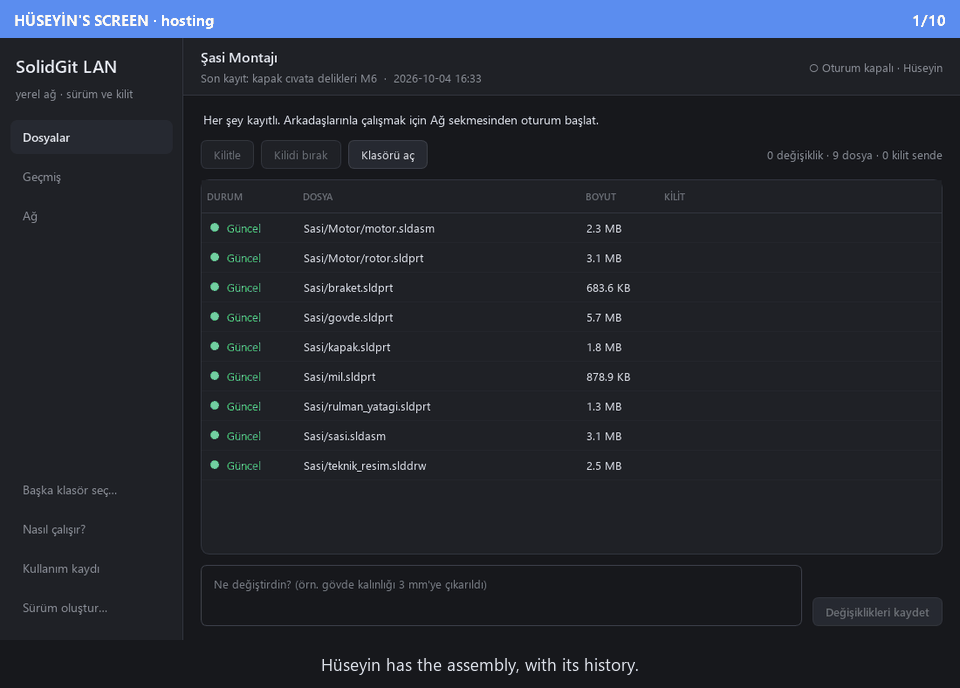
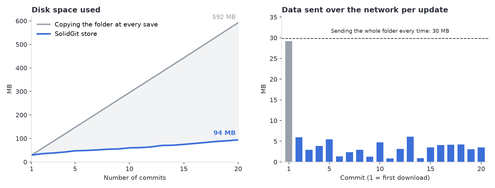

# SolidGit LAN

🇹🇷 [Türkçe](README.md)

**Serverless version control and file locking for SolidWorks assemblies, over a local network.**



One person turns on their laptop's hotspot and shares the project; teammates join the same
network and download it. Each part is locked by one person at a time, every saved version stays
in the history, and updates only send the files that actually changed. No internet, no server,
no accounts, nothing to install.

📘 **[Your first session in 5 minutes →](docs/TUTORIAL.en.md)**

> The interface is in Turkish; the tutorial explains every screen in English.

---

## Why?

SolidWorks files (`.sldprt`, `.sldasm`, `.slddrw`) are binary: no tool can merge two people's
changes to the same part line by line. That makes Git a poor fit for CAD — it tries to resolve
conflicts after the fact, when for CAD they have to be **prevented**. Systems that do prevent
them, like SolidWorks PDM, need a server, licences and an administrator — too heavy for a
student team or a small workshop. So most teams copy the folder as `Assembly_final`,
`Assembly_final_v2`, `Assembly_REALLY_final`, carry it around on a USB stick, and sooner or
later someone's work lands on top of someone else's.

SolidGit LAN fills that gap: it handles locking and history the way a PDM does, but its server
is simply the laptop of whoever started the session, and the network can be as basic as that
laptop's hotspot.

## Features

<table>
<tr>
<td width="50%"><br>
<b>Files and locks.</b> Each file's state (up to date / changed / new) and who holds it. Once
you start using locks, files you have not locked are read-only on disk, so SolidWorks opens
them read-only too and they cannot be changed by accident.</td>
<td width="50%"><br>
<b>Sessions and joining.</b> A session on the same network shows up in the list by itself.
Joining takes a code — and the code alone is not enough: the host has to let you in.</td>
</tr>
<tr>
<td><br>
<b>History and restore.</b> Who changed what, and when. Any file can be restored to how it was
in any commit; history is never deleted.</td>
<td><br>
<b>Merging after working apart.</b> If two people changed the same part, they decide which
version stays — and nothing changes until the other side approves the same choices.</td>
</tr>
</table>

### Interface overview


| # | |
|---|---|
| 1 | **Pages** — Files, History, Network. With no project open only Network is available, so someone without the files can still join. |
| 2 | **What to do now** — a one-sentence prompt based on your current state. |
| 3 | **Lock buttons** — only the ones that fit the selection are enabled. "⬇ take" appears here when teammates have sent work; the host can break someone's lock (after a confirmation). |
| 4 | **File list** — state and lock holder. A teammate's lock shows up immediately. |
| 5 | **Commit box** — one sentence about what you did, then save; your locks are released. |
| 6 | **Session status** — how many people are connected, and pending requests. |

## Measured: an unchanged part is stored once and sent once



Measured over 20 commits on a roughly 30 MB, 12-file assembly (1–2 parts change per commit).
Copying the folder at every save costs **592 MB**; the SolidGit store stays at **94 MB**. After
the first download, each update sent an average of **3.4 MB** over the network — about a ninth
of resending the whole folder.

> The numbers are measured from the tool itself by [`docs/grafik_uret.py`](docs/grafik_uret.py):
> a real store, a real session and real transfers over TLS. Raw data:
> [`grafik_veri.csv`](docs/images/grafik_veri.csv). File contents are incompressible random
> bytes, so the chart shows the effect of deduplication only; compression is deliberately left
> out.

## Engineering

- **PDM thinking, not Git.** Binary files cannot be merged, so there are no branches or merges;
  conflicts are prevented with locks. A lock needs a single arbiter, so the session host's
  machine owns the lock table — while everyone keeps a full copy of the data.
- **Content-addressed store.** Every file version is named by the SHA-256 of its content and
  stored with zstd. An unchanged part is stored once however many commits mention it; syncing
  reduces to "which of these hashes am I missing"; corruption is caught on every read.
- **Commit ids are derived from content**, not sequence numbers: two people working offline
  cannot both mint a different "commit 343".
- **"Which is newer?" is answered by the commit chain, never by clocks.** Machine clocks drift.
- **Multi-file locking is all or nothing.** Granting 9 of 12 locks produces a deadlock where two
  people wait on each other and neither can see why.
- **You cannot lock a file you are behind on.** In a model where changes are pulled rather than
  pushed onto you, that is the only door to overwriting newer work with an old version — and it
  is closed.
- **HEAD and TIP are separate.** A teammate's work joins the shared history at once, but the
  files on your disk never change underneath SolidWorks; you take the update when you are
  ready. Taking it touches only the files that actually changed and never overwrites an
  unsaved edit.
- **Security.** The join code is stretched with scrypt. The mutual HMAC proof is bound to the
  TLS certificate fingerprint — an interceptor who somehow knew the code still cannot get in —
  and the host proves itself first, so a fake host learns nothing. A correct code still needs
  the host's approval. The session's private key never touches the project folder and is
  deleted when the session ends.
- **Interruption-safe.** Every write goes temp file → fsync → rename. Transfers resume with HTTP
  Range. Every received file is verified against its hash, and the working folder is changed
  last — an interrupted sync never leaves a half-updated assembly.
- **Different files merge by themselves; the same file goes to a person.** When two people
  work on different parts at once and both send, the second sender's work is placed on top of
  what arrived in between and the history stays a single line — nobody is asked anything. If
  both changed the same file, the common ancestor is computed, only those files are asked
  about, nothing is written until both sides approve the same choices, and the version not
  chosen is never deleted.

## Quick start

**You need:** Windows and [Python 3.12+](https://www.python.org/downloads/) (tick "Add Python
to PATH" when installing).

```bat
git clone https://github.com/HCE-Engineer/solidgit-lan.git
cd solidgit-lan
SolidGitLAN.bat
```

`SolidGitLAN.bat` sets up a virtual environment on first run and opens the window after that.

**Teammates without Python:** in the app, **Sürüm oluştur…** (Build a version) — or
`python -m solidgit_lan build` — produces a single zip under `dagitim/`. They unzip it and
double-click `SolidGitLAN.exe`. The package includes an `OKU-BENI.txt` (read-me) explaining
the rest.

<details>
<summary>Manual setup and tests</summary>

```bat
python -m venv .venv
.venv\Scripts\pip install -e ".[net,ui,dev]"
.venv\Scripts\python -m solidgit_lan.ui          :: the window
.venv\Scripts\python -m pytest                   :: 192 tests
.venv\Scripts\python -m ruff check .             :: lint
.venv\Scripts\python docs\gorsel_uret.py         :: README screenshots and GIF
.venv\Scripts\python docs\grafik_uret.py         :: README chart
```

There is also a command line: `python -m solidgit_lan --help`
(`init`, `commit`, `log`, `serve`, `connect`, `build` …).
</details>

## How it works

```mermaid
sequenceDiagram
    autonumber
    participant A as Ahmet (joining)
    participant H as Hüseyin (hosting)
    H-->>A: UDP broadcast + mDNS: "Şasi Montajı is here"
    A->>H: Join request (a random nonce)
    H->>A: Host proves itself first — HMAC from the code, bound to the TLS fingerprint
    A->>H: Ahmet proves himself
    Note over H: Hüseyin clicks "Allow"
    H->>A: Device token
    A->>H: Which commits exist?
    H->>A: Missing files — verified by SHA-256, resumed if cut off
    A->>H: Lock govde.sldprt
    H-->>A: Granted — visible in everyone's list
    A->>H: New commit + the changed files
    Note over H: Files unchanged on disk; "⬇ 1 new change — take"
```

The code is three layers with one-way dependencies: `core` knows nothing about the network or
the interface, which is why every rule can be tested without a second machine, a hotspot or
SolidWorks.

```
solidgit_lan/
├── core/        pure logic: content-addressed store, commit chain, lock table, reconciliation
├── net/         discovery (UDP + mDNS), TLS + joining, transfer and sync, coordinator server
├── ui/          PySide6 interface — holds no rules, only explains core's decisions
├── cli.py       command line (for running several peers on one machine)
├── packaging.py "Build a version" — a distributable zip via PyInstaller
└── telemetry.py local usage log
tests/           18 files, 192 tests — real TLS server, real sockets, offscreen Qt
docs/            design notes, protocol, tutorial, and the scripts that produce the visuals
```

Design notes (in Turkish): [architecture](docs/01-MIMARI-TASLAK.md) ·
[network protocol](docs/02-PROTOKOL.md) · [feature pool](docs/03-OZELLIK-HAVUZU.md)

## Limitations

- **No direct SolidWorks integration.** You lock files from the app by hand. Locking a part
  automatically when it is opened in SolidWorks, announcing that it has been opened ("Ahmet
  opened it" — ready in the protocol and the interface, with nothing yet to trigger it from
  SolidWorks), and part preview images are not built yet.
- **Locks live as long as the session.** If the host closes the app, the lock table resets;
  handing the session over to someone else is not supported.
- **"No references outside the folder" is a rule, not a check.** The tool does not open an
  assembly to verify its references. Toolbox parts that were not copied into the folder may be
  missing on another machine.
- **Discovery depends on the network allowing broadcasts.** On networks with client isolation
  (some corporate or campus Wi-Fi) the session may not appear in the list; connecting by address
  is only available on the command line for now (`connect --host`). If the host also runs the
  hotspot from their own laptop, teammates connect to them directly. Windows Firewall may ask on
  first use — allow "Private networks".
- **Only tried on Windows** (Windows 11, Python 3.13). All automated tests run on a single
  machine, over real TLS and real sockets.
- **File contents are never opened;** there is no visual diff between two versions.
- **The package is unsigned;** Windows SmartScreen warns on first launch ("More info → Run
  anyway").
- **Usage log:** to make problems visible, the app writes which buttons were pressed and how
  long actions took to a local file (never typed text or file contents). Nothing is sent
  anywhere; it can be switched off from **Kullanım kaydı** (Usage log) in the sidebar.

## Credits

Open-source libraries used:

| Library | Used for | Licence |
|---|---|---|
| [PySide6 / Qt](https://doc.qt.io/qtforpython/) | desktop interface | LGPL-3.0 |
| [FastAPI](https://fastapi.tiangolo.com/) | coordinator HTTP endpoints | MIT |
| [Uvicorn](https://www.uvicorn.org/) | HTTPS server | BSD-3-Clause |
| [HTTPX](https://www.python-httpx.org/) | client side | BSD-3-Clause |
| [python-zeroconf](https://github.com/python-zeroconf/python-zeroconf) | mDNS discovery | LGPL-2.1 |
| [cryptography](https://cryptography.io/) | certificate generation | Apache-2.0 / BSD |
| [python-zstandard](https://github.com/indygreg/python-zstandard) | store compression | BSD-3-Clause |
| [PyInstaller](https://pyinstaller.org/) | distribution package (build time only) | GPL-2.0 with exception |
| pytest, Ruff, Matplotlib, Pillow | tests, lint, README visuals (development only) | MIT / MIT / Matplotlib / HPND |

- **Inspiration:** [GIT4SW](https://codeberg.org/dymaxionkim/GIT4SW) (a SolidWorks client built
  on Git + LFS locking) — its behaviour was studied; since it carries no licence, none of its
  code was copied, and this project was written from scratch with a different architecture (its
  own store and a local network instead of Git/LFS). Interface layout inspired by
  [Anchorpoint](https://www.anchorpoint.app/).

## Licence

[MIT](LICENSE)
