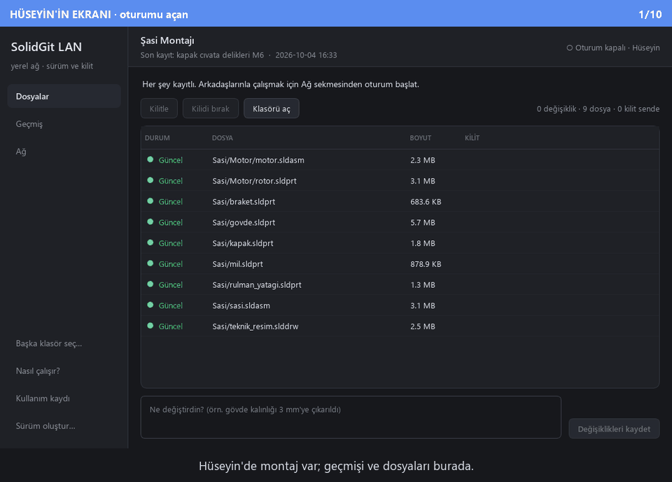
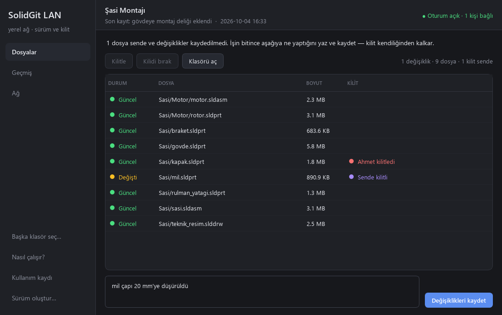
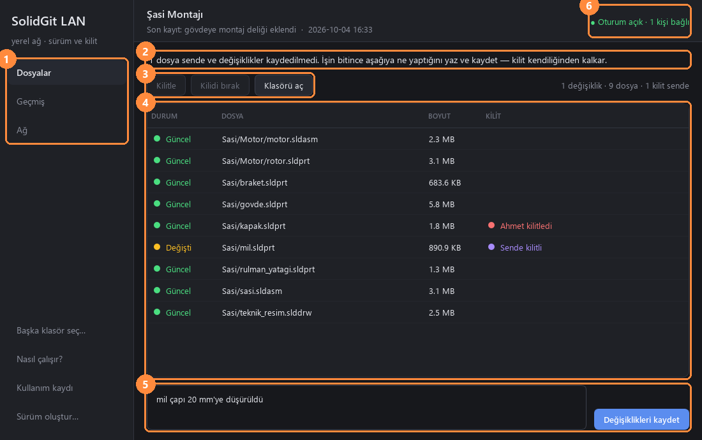
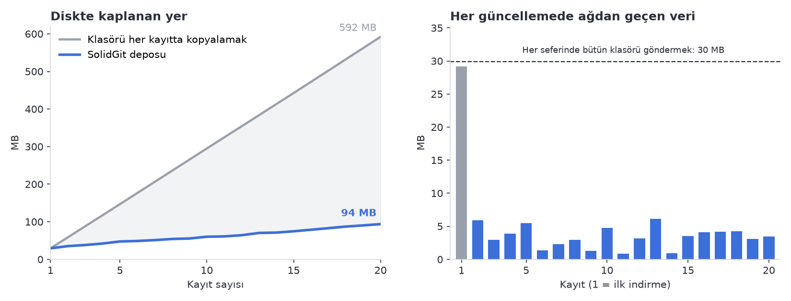

# SolidGit LAN

🇬🇧 [English](README.en.md)

**SolidWorks montajları için yerel ağda çalışan, sunucusuz sürüm kontrolü ve dosya kilitleme sistemi.**



Bir kişi bilgisayarının hotspot'unu açıp projesini paylaşır; takım arkadaşları aynı ağa
bağlanıp projeyi indirir. Her parça aynı anda yalnızca bir kişide kilitlidir, kaydedilen her
sürüm geçmişte kalır ve güncellemeler ağdan yalnızca değişen dosyalar kadar gider. İnternet,
sunucu, hesap ya da kurulum gerekmez.

📘 **[5 dakikada ilk oturum →](docs/TUTORIAL.md)**

---

## Neden gerekli?

SolidWorks dosyaları (`.sldprt`, `.sldasm`, `.slddrw`) ikilidir: iki kişinin aynı parçada
yaptığı değişikliği hiçbir araç satır satır birleştiremez. Git bu yüzden CAD için uygun değildir
— çakışmayı sonradan çözmeye çalışır, oysa CAD'de çakışmanın **önlenmesi** gerekir. Bunu yapan
SolidWorks PDM gibi sistemler ise sunucu, lisans ve yönetici ister; bir öğrenci takımı ya da
küçük bir atölye için ağırdır. Sonuçta çoğu takım klasörü `Montaj_son`, `Montaj_son_v2`,
`Montaj_GERCEK_son` diye kopyalar, flash bellekle taşır ve er geç birinin işi başkasınınkinin
üzerine yazılır.

SolidGit LAN bu boşluğu doldurur: kilitleme ve geçmişi bir PDM gibi yönetir, ama sunucusu
oturumu açan kişinin kendi bilgisayarıdır ve ağı bir laptop hotspot'u kadar basit olabilir.

## Özellikler

<table>
<tr>
<td width="50%"><br>
<b>Dosyalar ve kilitler.</b> Her dosyanın durumu (güncel / değişti / yeni) ve kimde kilitli
olduğu. Kilit kullanmaya başladığında, kilitlemediğin dosyalar diskte salt-okunur olur; böylece
SolidWorks onları da salt-okunur açar ve kazara değiştirilemezler.</td>
<td width="50%"><br>
<b>Oturum ve katılım.</b> Aynı ağdaki oturum listede kendiliğinden görünür. Katılmak için
kod gerekir; kod da yetmez — oturumu açan kişi izin vermeden kimse giremez.</td>
</tr>
<tr>
<td><br>
<b>Geçmiş ve geri yükleme.</b> Kim, neyi, ne zaman değiştirdi. Herhangi bir dosyanın
herhangi bir kayıttaki hâli geri yüklenebilir; geçmiş hiçbir zaman silinmez.</td>
<td><br>
<b>Ayrı çalışınca birleştirme.</b> İkiniz de aynı parçayı değiştirdiyseniz hangisinin
kalacağına siz karar verirsiniz; karşı taraf aynı seçimleri onaylamadan hiçbir dosya
değişmez.</td>
</tr>
</table>

### Arayüze genel bakış



| # | |
|---|---|
| 1 | **Sayfalar** — Dosyalar, Geçmiş, Ağ. Proje açık değilken yalnızca Ağ açıktır: dosyaları olmayan biri de katılabilsin diye. |
| 2 | **Şimdi ne yapmalısın** — durumuna göre tek cümlelik yönlendirme. |
| 3 | **Kilit butonları** — yalnızca seçime uyanlar etkindir. Takımdan değişiklik gelince "⬇ al" burada belirir; oturumu açan kişi başkasının kilidini (onay sorularak) kırabilir. |
| 4 | **Dosya listesi** — durum ve kilit sahibi. Arkadaşının kilidi anında görünür. |
| 5 | **Kayıt kutusu** — ne yaptığını bir cümleyle yazıp kaydedersin; kilit kendiliğinden kalkar. |
| 6 | **Oturum durumu** — oturuma bağlı kişi sayısı ve bekleyen istekler. |

## Ölçüm: değişmeyen parça bir kez saklanır, bir kez gönderilir



Yaklaşık 30 MB'lık, 12 dosyalı bir montajda 20 kayıt boyunca ölçüldü (her kayıtta 1–2 parça
değişiyor). Klasörü her kayıtta kopyalamak **592 MB** tutarken SolidGit deposu **94 MB**'ta
kaldı. İlk indirmeden sonra her güncellemede ağdan ortalama **3,4 MB** geçti — bütün klasörü
yeniden göndermenin yaklaşık dokuzda biri.

> Sayılar [`docs/grafik_uret.py`](docs/grafik_uret.py) ile aracın kendisinden ölçülür:
> gerçek depo, gerçek bir oturum ve TLS üzerinden gerçek aktarım. Ham veri:
> [`grafik_veri.csv`](docs/images/grafik_veri.csv). Dosya içerikleri sıkıştırılamayan rastgele
> baytlardır; grafik yalnızca tekilleştirmenin etkisini gösterir, sıkıştırmanın katkısı bilerek
> dışarıda bırakılmıştır.

## Mühendislik tarafı

- **Git değil, PDM mantığı.** İkili dosyalar birleştirilemediği için branch/merge yoktur;
  çakışma kilitle önlenir. Kilit tek bir hakem gerektirdiğinden kilit tablosunun tek sahibi
  oturumu açan bilgisayardır — ama veri herkeste tam kopya olarak durur.
- **İçerik-adresli depo.** Her dosya sürümü içeriğinin SHA-256 özetiyle adlandırılır ve zstd
  ile saklanır. Değişmeyen parça kaç kayıtta geçerse geçsin bir kez durur; eşitleme "bende bu
  özetler yok" sorusuna iner; bozulma her okumada yakalanır.
- **Kayıt kimliği içerikten türetilir**, sıra numarası değildir: çevrimdışı çalışan iki kişinin
  aynı numaralı farklı kayıt üretmesi mümkün olmaz.
- **"Hangisi daha yeni?" saatle değil, kayıt zinciriyle cevaplanır.** Makinelerin saatleri
  tutarsız olabilir.
- **Çoklu kilit ya hep ya hiç.** 12 kilitten 9'unu vermek, iki kişinin birbirini beklediği ve
  kimsenin nedenini göremediği bir kilitlenme (deadlock) üretirdi.
- **Geride olduğun dosyayı kilitleyemezsin.** Değişikliklerin zorla itilmediği bir modelde
  eski bir sürümü düzenleyip yenisinin üzerine yazmanın tek kapısı budur — ve kapalıdır.
- **HEAD ve TIP ayrıdır.** Arkadaşının gönderdiği iş paylaşılan geçmişe hemen girer ama senin
  diskindeki dosyalar, SolidWorks'te açıkken altından değişmez; hazır olunca "al" dersin.
  Alma işlemi yalnızca gerçekten değişen dosyalara dokunur ve kaydedilmemiş bir düzenlemenin
  üzerine asla yazmaz.
- **Güvenlik.** Katılım kodu scrypt ile anahtara dönüşür. Karşılıklı HMAC kanıtı TLS
  sertifikasının parmak izine bağlıdır — araya giren biri kodu bilse bile geçemez — ve önce
  host kanıtlar, böylece sahte bir host hiçbir şey öğrenemez. Kod doğru olsa da host onayı
  zorunludur. Oturum anahtarı proje klasörüne yazılmaz, oturum bitince silinir.
- **Kesintiye dayanıklılık.** Her yazma geçici dosya → fsync → yeniden adlandırma ile yapılır.
  Aktarım HTTP Range ile kaldığı yerden devam eder. Gelen her dosya özetiyle doğrulanır ve
  çalışma klasörü en son değiştirilir — yarıda kalan bir eşitleme yarı güncellenmiş montaj
  bırakmaz.
- **Farklı dosyalar kendiliğinden birleşir, aynı dosya insana sorulur.** İki kişi aynı anda
  farklı parçalar üzerinde çalışıp gönderdiğinde ikinci gönderenin işi arada gelenin üzerine
  eklenir ve geçmiş tek çizgi kalır — kimseye bir şey sorulmaz. İkisi de aynı dosyayı
  değiştirdiyse ortak ata hesaplanır, yalnızca o dosyalar sorulur, iki taraf aynı seçimleri
  onaylamadan hiçbir şey yazılmaz ve seçilmeyen sürüm silinmez.

## Hızlı başlangıç

**Gereken:** Windows ve [Python 3.12+](https://www.python.org/downloads/) (kurarken
"Add Python to PATH" işaretli olsun).

```bat
git clone https://github.com/HCE-Engineer/solidgit-lan.git
cd solidgit-lan
SolidGitLAN.bat
```

`SolidGitLAN.bat` ilk açılışta sanal ortamı kurar, sonraki açılışlarda doğrudan pencereyi açar.

**Arkadaşların Python kurmasın:** uygulamada **Sürüm oluştur…** ya da
`python -m solidgit_lan build` çalıştırınca `dagitim/` altında tek bir zip çıkar. Zip'i açıp
`SolidGitLAN.exe`'ye çift tıklamaları yeter. Pakette ne yapılacağını anlatan bir
`OKU-BENI.txt` de var.

<details>
<summary>Elle kurulum ve testler</summary>

```bat
python -m venv .venv
.venv\Scripts\pip install -e ".[net,ui,dev]"
.venv\Scripts\python -m solidgit_lan.ui          :: pencere
.venv\Scripts\python -m pytest                   :: 192 test
.venv\Scripts\python -m ruff check .             :: lint
.venv\Scripts\python docs\gorsel_uret.py         :: README görselleri
.venv\Scripts\python docs\grafik_uret.py         :: README grafiği
```

Arayüzsüz komut satırı da var: `python -m solidgit_lan --help`
(`init`, `commit`, `log`, `serve`, `connect`, `build` …).
</details>

## Nasıl çalışıyor

```mermaid
sequenceDiagram
    autonumber
    participant A as Ahmet (katılan)
    participant H as Hüseyin (oturumu açan)
    H-->>A: UDP yayını + mDNS: "Şasi Montajı burada"
    A->>H: Katılım isteği (rastgele sayı)
    H->>A: Host önce kanıtlar — koddan türetilen, TLS parmak izine bağlı HMAC
    A->>H: Ahmet de kanıtlar
    Note over H: Hüseyin "İzin ver" der
    H->>A: Cihaz anahtarı (token)
    A->>H: Hangi kayıtlar var?
    H->>A: Eksik dosyalar — SHA-256 ile doğrulanır, kesilirse kaldığı yerden
    A->>H: Kilit iste: govde.sldprt
    H-->>A: Verildi — herkesin listesinde görünür
    A->>H: Yeni kayıt + değişen dosyalar
    Note over H: Dosyaları değişmez; "⬇ 1 yeni değişiklik — al"
```

Kod üç katmandır ve bağımlılık tek yönlüdür: `core` ne ağı ne arayüzü bilir — bu yüzden bütün
kurallar ikinci bir bilgisayar, hotspot ya da SolidWorks olmadan test edilebilir.

```
solidgit_lan/
├── core/        saf mantık: içerik-adresli depo, kayıt zinciri, kilit tablosu, birleştirme
├── net/         keşif (UDP + mDNS), TLS + katılım, aktarım ve eşitleme, koordinatör sunucusu
├── ui/          PySide6 arayüzü — kural tutmaz, yalnızca core'un kararlarını anlatır
├── cli.py       komut satırı (aynı makinede birden çok eşi denemek için)
├── packaging.py "Sürüm oluştur" — PyInstaller ile dağıtılabilir zip
└── telemetry.py yerel kullanım kaydı
tests/           18 dosya, 192 test — gerçek TLS sunucusu, gerçek soketler, offscreen Qt
docs/            tasarım belgeleri, protokol, rehber ve görselleri üreten betikler
```

Ayrıntılar: [mimari taslak](docs/01-MIMARI-TASLAK.md) · [ağ protokolü](docs/02-PROTOKOL.md) ·
[özellik havuzu](docs/03-OZELLIK-HAVUZU.md)

## Sınırlamalar

- **SolidWorks ile doğrudan bağlantı yok.** Dosyaları uygulamadan elle kilitlersin. Bir parça
  SolidWorks'te açılınca otomatik kilitlemek, açıldığını takıma duyurmak ("Ahmet açtı" — protokol
  ve arayüzde hazır, onu tetikleyecek SolidWorks bağlantısı yok) ve parça önizleme resimleri
  henüz yapılmadı.
- **Kilitler oturum süresince yaşar.** Oturumu açan kişi uygulamayı kapatırsa kilit tablosu
  sıfırlanır; oturumu başka birine devretme yok.
- **"Klasör dışına referans verilmemeli" bir kuraldır, denetim değil.** Araç montajın
  referanslarını açıp kontrol etmez. Toolbox parçaları klasöre kopyalanmadıysa başka bilgisayarda
  eksik görünebilir.
- **Keşif yerel ağın yayınlara izin vermesine bağlıdır.** İstemci yalıtımı olan ağlarda (bazı
  kurumsal ya da kampüs Wi-Fi'ları) oturum listede görünmeyebilir; adresle bağlanma şimdilik
  yalnızca komut satırında var (`connect --host`). Oturumu açan kişi hotspot'u da kendi
  bilgisayarından açarsa katılanlar ona doğrudan bağlanır. İlk bağlantıda Windows Güvenlik
  Duvarı izin isteyebilir — "Özel ağlar"a izin verilmeli.
- **Yalnızca Windows'ta denendi** (Windows 11, Python 3.13). Otomatik testlerin tamamı tek
  bilgisayarda, gerçek TLS ve gerçek soketlerle çalışır.
- **Dosyaların içi açılmaz;** iki sürüm arasında görsel fark gösterilmez.
- **Paket imzasızdır;** Windows SmartScreen ilk açılışta uyarı verir ("Ek bilgi → Yine de
  çalıştır").
- **Kullanım kaydı:** uygulama, sorunları görebilmek için hangi butona basıldığını ve
  işlemlerin süresini yerel bir dosyaya yazar (yazılan metinler ve dosya içerikleri hariç).
  Hiçbir yere gönderilmez; sol menüdeki **Kullanım kaydı**'ndan kapatılabilir.

## Kaynaklar ve teşekkür

Kullanılan açık kaynak kütüphaneler:

| Kütüphane | Ne için | Lisans |
|---|---|---|
| [PySide6 / Qt](https://doc.qt.io/qtforpython/) | masaüstü arayüzü | LGPL-3.0 |
| [FastAPI](https://fastapi.tiangolo.com/) | koordinatörün HTTP uçları | MIT |
| [Uvicorn](https://www.uvicorn.org/) | HTTPS sunucusu | BSD-3-Clause |
| [HTTPX](https://www.python-httpx.org/) | istemci tarafı | BSD-3-Clause |
| [python-zeroconf](https://github.com/python-zeroconf/python-zeroconf) | mDNS keşfi | LGPL-2.1 |
| [cryptography](https://cryptography.io/) | sertifika üretimi | Apache-2.0 / BSD |
| [python-zstandard](https://github.com/indygreg/python-zstandard) | depo sıkıştırması | BSD-3-Clause |
| [PyInstaller](https://pyinstaller.org/) | dağıtım paketi (yalnızca derlerken) | GPL-2.0 + istisna |
| pytest, Ruff, Matplotlib, Pillow | test, lint, README görselleri (yalnızca geliştirirken) | MIT / MIT / Matplotlib / HPND |

- **İlham:** [GIT4SW](https://codeberg.org/dymaxionkim/GIT4SW) (Git + LFS kilitleme ile
  SolidWorks istemcisi) — davranışı incelendi; lisansı belirtilmediği için kodundan hiçbir şey
  kopyalanmadı, bu proje sıfırdan ve farklı bir mimariyle (Git/LFS yerine kendi deposu ve yerel
  ağ) yazıldı. Arayüz düzeni için [Anchorpoint](https://www.anchorpoint.app/).

## Lisans

[MIT](LICENSE)
