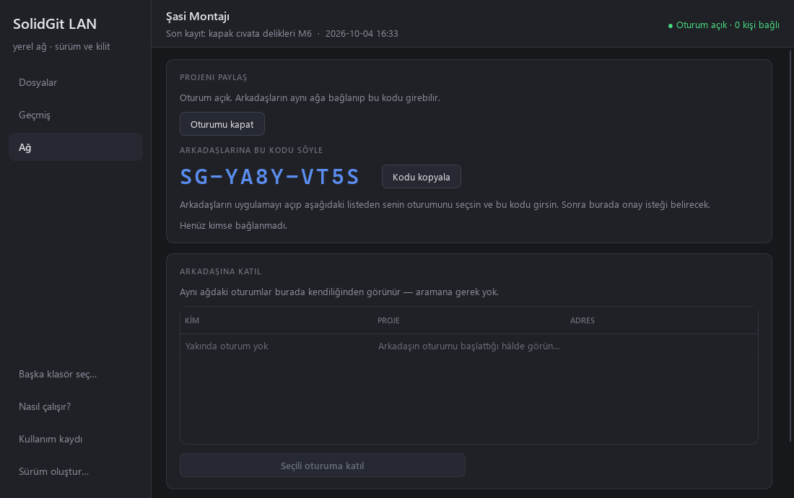
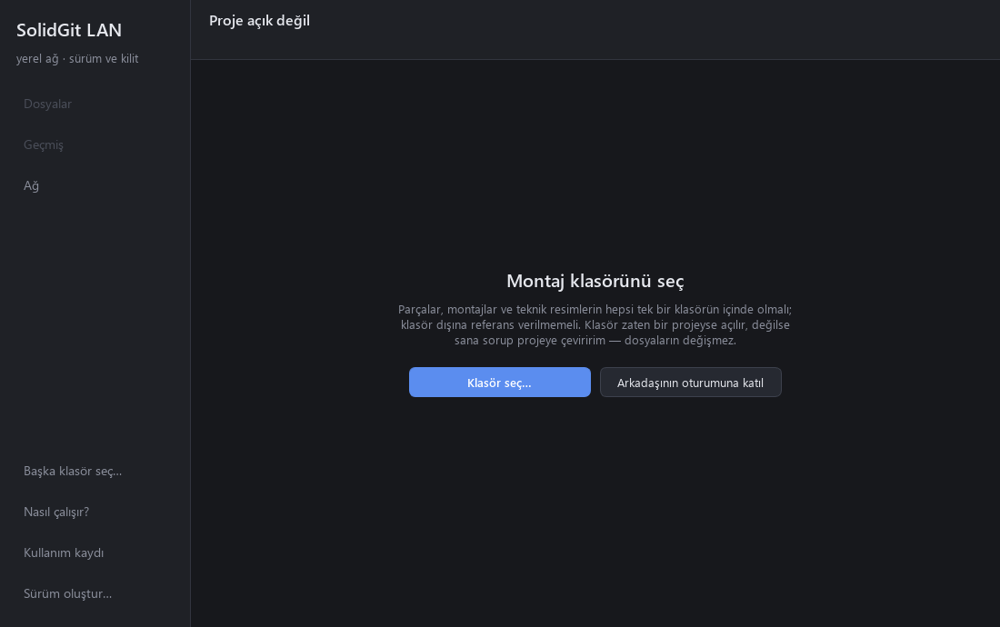
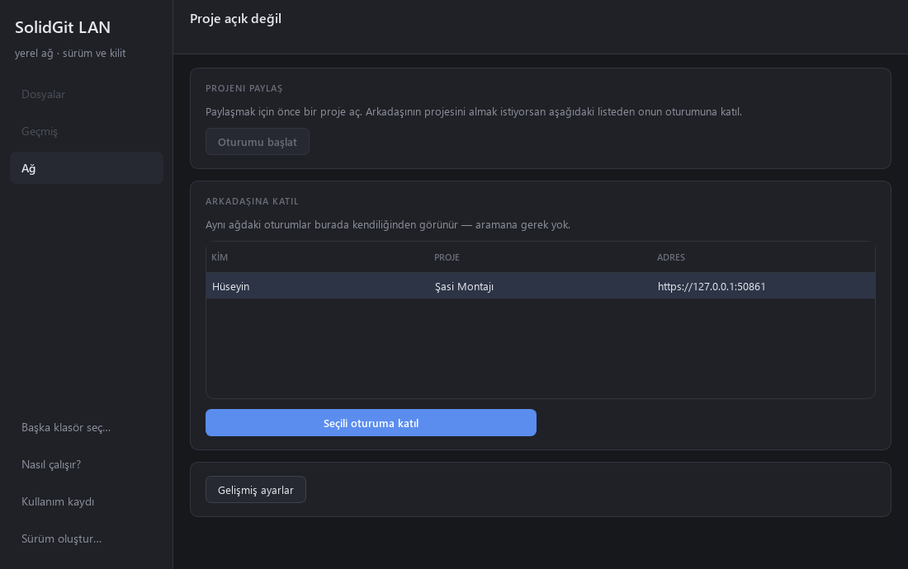
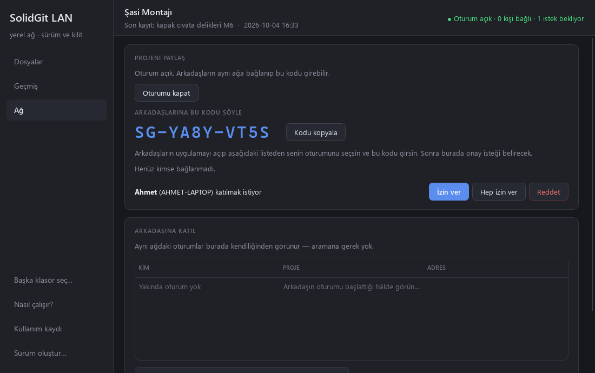
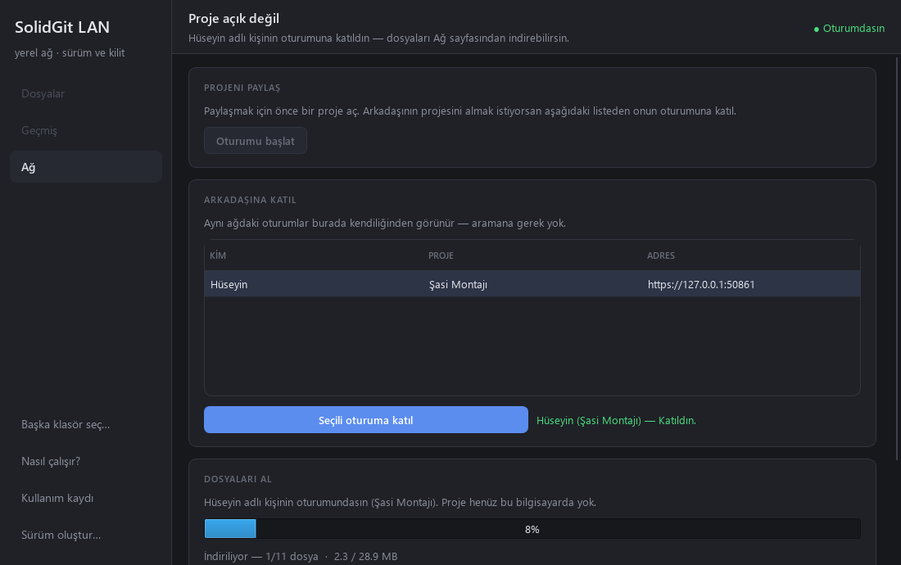
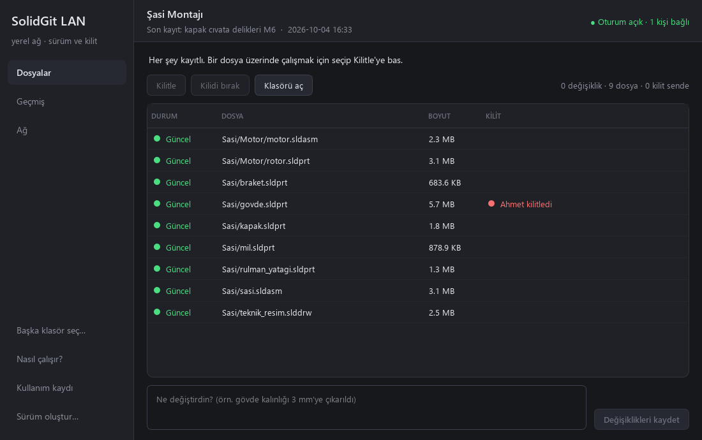
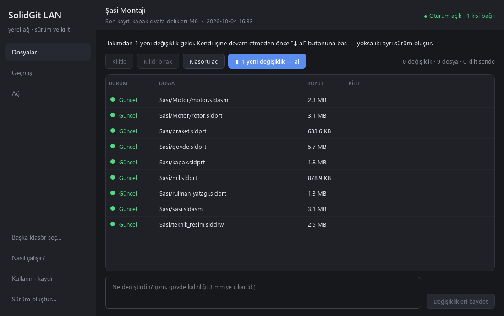
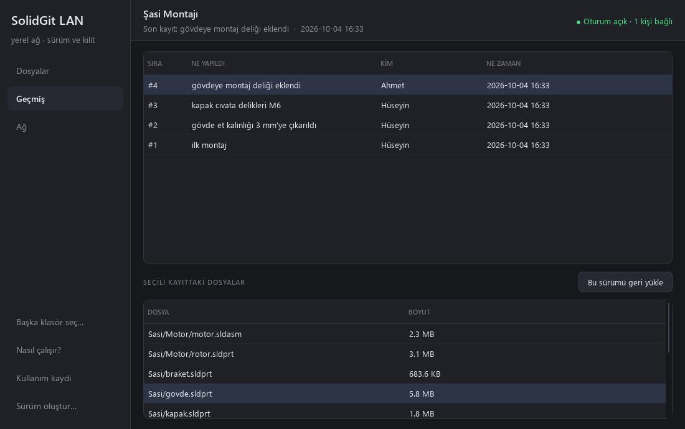
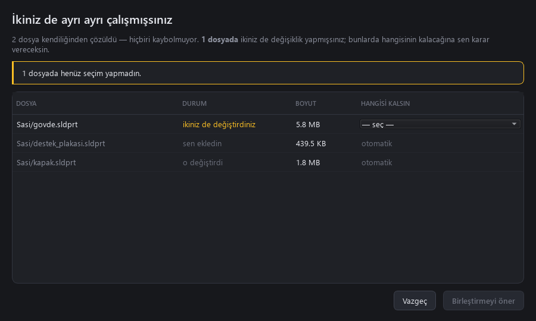

# Your first session in 5 minutes

🇹🇷 [Türkçe](TUTORIAL.md) · ← [README](../README.en.md)

Two people: **Hüseyin** has the assembly and starts the session; **Ahmet** is a teammate who
does not have the files yet. A third or fourth person just repeats Ahmet's steps.

The interface is in Turkish, so each button is given as it appears on screen with its meaning
in brackets.

> **Before you start:** everyone needs the app — either from source with `SolidGitLAN.bat`, or
> from the zip made with **Sürüm oluştur…** (Build a version). Everyone must run the same
> version; different versions refuse to connect to each other.

---

## Hüseyin — shares the project

### 1. Open the assembly folder

**Klasör seç…** (Choose folder) → pick the assembly folder. If it is not a project yet you are
asked; say yes. Your files are not touched — only a hidden `.solidgit` folder is added.

On the Files page everything shows as **Yeni** (new). Type a short name in the box at the
bottom ("start" will do) and press **Değişiklikleri kaydet** (Save changes). Every file is now
**Güncel** (up to date).

> Rule: parts, assemblies and drawings must all live **inside one folder**, with no references
> pointing outside it. Copy Toolbox parts into the folder too.

### 2. Start the session

Turn on your laptop's hotspot (or have everyone join the same Wi-Fi). **Ağ** (Network) →
**Oturumu başlat** (Start session). A code appears in large letters; read it out to your team.

The first time, Windows Firewall may ask — allow **Private networks**.

---

## Ahmet — joins and downloads

### 3. "Join a teammate's session"

Open the app. No project needed — press **Arkadaşının oturumuna katıl** (Join a teammate's
session).

### 4. Pick the session, enter the code

Hüseyin's session appears in the list on its own. Select it → **Seçili oturuma katıl** (Join
selected session) → type the code.

Meanwhile a request appears on Hüseyin's screen. **Ahmet cannot get in until Hüseyin presses
"İzin ver" (Allow)** — even with the right code.

### 5. Download the files

**Dosyaları indir** (Download files) → choose where the project should go (a new folder is
created inside it). The progress bar shows real file sizes; if the connection drops, pressing
again continues where it stopped. When it finishes, the window switches to the Files page.

---

## Working together

### 6. Lock → edit → save → send

1. Select the file you will work on and press **Kilitle** (Lock). It is now yours; files you
   have not locked become read-only.
2. Edit and save in SolidWorks. The row turns **Değişti** (changed).
3. Describe what you did in the box at the bottom, press **Değişiklikleri kaydet**. Your lock is
   released.
4. If you are Ahmet: **Ağ** → **Kendi değişikliklerimi gönder** (Send my changes).

A lock shows up on everyone's screen at once — here Hüseyin sees that Ahmet holds the body:

### 7. Take incoming changes

When someone sends something, your files **do not change by themselves** — so a part is never
pulled out from under an assembly open in SolidWorks. Instead **⬇ 1 yeni değişiklik — al**
(1 new change — take) appears; press it when you are ready.

On Ahmet's side the same is **Ağ → Yeni değişiklikleri al** (Take new changes). Taking only
touches the files that changed; if it would overwrite an edit you have not saved, it stops and
asks you to save first.

If someone saved a **different** file in the meantime, sending still works: your change is
placed on top of theirs and nobody is asked anything.

### 8. Go back to an older version

**Geçmiş** (History) → select a commit → select a file below → **Bu sürümü geri yükle**
(Restore this version). The file returns to that state and shows as changed; saving adds it to
the history as a new commit. Nothing is deleted.

### 9. If you worked apart

If you both changed the **same** part (for example while one of you was outside the
session), sending shows **Ayrılığı çöz…** (Resolve the split). Only genuinely conflicting files are asked about; choose
which version of each stays. Nothing changes until the other side approves the same choices,
and the version not chosen stays in the history.

---

## If something goes wrong

| Symptom | Check |
|---|---|
| The session is not in the list | Are you on the same network? Did Hüseyin allow the firewall prompt? |
| "Different version" warning | Everyone should install from the same zip. |
| "A newer version exists, update first" | Take the update first, then lock. |
| "Locked by someone else" | Ask that person; the host can **Kilidi kır** (Break lock) if really needed. |
| An error you do not understand | Sidebar → **Kullanım kaydı** (Usage log) → the newest `.jsonl` shows what happened. |

## Terms

| In the app | Meaning | Git equivalent |
|---|---|---|
| Kayıt | A snapshot of the folder at that moment | commit |
| Kilit | "This file is mine right now; nobody else can change it" | (Git LFS lock) |
| Oturum | The time someone is sharing their project on the network | — |
| Katılım kodu | One-time code needed to join a session | — |
| Al | Apply incoming changes to your files | pull |
| Gönder | Send your commits to the session | push |
| Ayrılık / birleştirme | Deciding which version stays after working apart | merge (but never automatic) |
| Salt-okunur | A file that cannot be changed on disk; SolidWorks opens it read-only | — |
